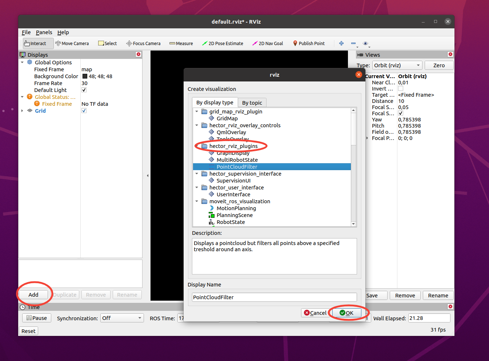
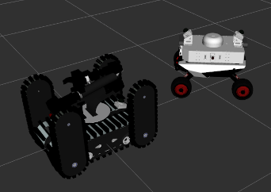
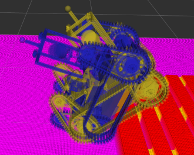
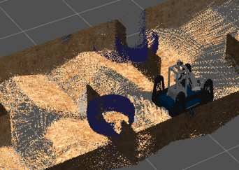
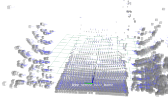

# hector_rviz_plugins
Collection of RViz plugins. Clone package into ROS Workspace and make. After that the rviz plugins are available for use within rviz. To use them simply add them in rviz.

## HectorViewController
A view controller with support for animation, movement using the arrow keys, 2D and 3D mode as well as ROS interfaces for control by external nodes.
It can also track a specified frame allowing the camera to follow the robot.
The tracked frame is followed with a P-controller with variable P-Gain to dampen the camera movements.

> [!TIP]
> Camera moves, spins, frame tracking and view-mode switches can be scripted from a YAML file!  
> See **[View Controller Playbook Executor](doc/VIEW_CONTROLLER_PLAYBOOK.md)**.

## MultiRobotModel
An RViz display to display multiple robot models. The models are automatically determined by scanning for namespaces containing a `robot_description` topic.
E.g. `/athena/robot_description` will create a `RobotModelDisplay` with `athena` as TF prefix and using the description topic as description.

## MultiRobotState
An RViz display to display multiple robot states with possibly differing positions and orientations.

Each entry may set its own `robot_description` (a topic name) so visually different robots
can be shown in one display; entries that leave it empty fall back to the display's *Robot
Description* property. URDFs are loaded asynchronously, so RViz never freezes while waiting for a
description, and a state is (re)applied automatically once its model becomes available.

## PointCloudFilter
An RViz display that allows to filter a point cloud spatially, i.e. removes points that lie above a specified threshold in a given direction (x,y,z) or max radial distance of a coordinate system.

## PointCloudNormal

An RViz display that displays the normals of a pointcloud as lines pointing from the point to the normal direction.
Please note that it does not visualize the pointcloud.

